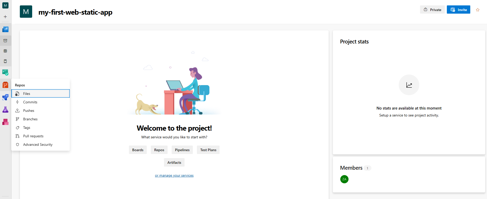
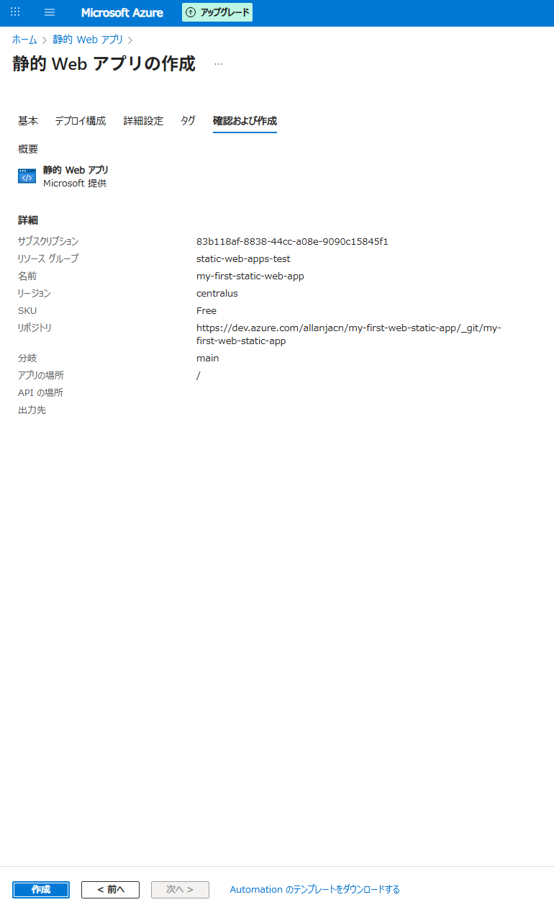

# Azure Static Web Apps開発　
> ## 目次  
> - [テンプレートプロジェクト作成からデプロイ](#azure)  
>   - [DevOpsからプロジェクト作成](#devopsからプロジェクト作成)
>   - [静的Webアプリデプロイ](#静的webアプリデプロイ)
> - [VS Codeの開発](#vs-code)  
>   - [前提](#前提-vscode-introduction)

## **はじめに**
### **Visual Studio Code**
- Visual Studio Codeをインストール  
      
- VS Codeの使い方　[VS Codeドキュメント](https://code.visualstudio.com/docs)  
VS Codeエクステンションは後ほど追加説明  
    > **ほかの開発ツールの使用も可能ですが、VS Codeは無料かつ軽量のため推奨**

### **Git**
- Gitをインストール [Gitインストーラ](https://github.com/git-for-windows/git/releases/download/v2.50.0.windows.2/Git-2.50.0.2-64-bit.exe ) 

## **Azure** 
### **前提**
- 既にAzure static web appsの料金プランを加入したこと
- アカウントがAzure DevOps組織加入したこと
### **DevOpsからプロジェクト作成**
> DevOpsから作成の手順です。今回はVS Codeから作成のため、下記は資料だけ。  
> 参考資料 [リンク](https://learn.microsoft.com/ja-jp/azure/static-web-apps/get-started-portal?tabs=vanilla-javascript&pivots=azure-devops)

1. Azure ProtalからDevOpsを開きます。  
  
2. 組織を選ぶ  
  
3. プロジェクト追加  
    > 既存プロジェクトがないの場合は追加画面が表示される  

      
     
4. リポジトリ追加
      
    static webのテンプレートをclone  
      
    完成  
      

### **静的Webアプリデプロイ** 
> 参考資料 [リンク](https://learn.microsoft.com/ja-jp/azure/static-web-apps/get-started-portal?tabs=vanilla-javascript&pivots=azure-devops)
1. ポータルから静的Webアプリを検索し、転移します。  
  
2. 新しい作成する
  
3. 作成ページ
下記の設定で作成    

    | 設定 | 値 |
    | --- | ---|
    | サブスクリプション | Azure サブスクリプションを選択します。|
    | リソース グループ | [新規作成] リンクを選択し、テキスト ボックスに「static-web-apps-test」と入力します|
    | 名前 | テキスト ボックスに、「my-first-static-web-app」と入力します。|
    | プランの種類 | [無料] を選択します。|
    | Azure Functions and staging details (Azure Functions とステージングの詳細) | 最も近いリージョンを選択します。|
    | ソース | [Azure DevOps] を選択します。 (デモはGitHub)|
    | 組織 | 自分の組織を選択します。 |
    | Project | プロジェクトを選択します。 |
    | リポジトリ | [my-first-web-static-app] を選択します。 |
    | [Branch]\(ブランチ) | \[main](メイン) を選択します。 |

  
  
  

## **VS Code**
### **前提** {#vscode-introduction}
- azure static web appエクステンションをインストール  
  

### **VS CodeでテンプレートからWeb Static App作成**
> 参考資料[リンク](https://learn.microsoft.com/ja-jp/azure/static-web-apps/getting-started?tabs=vanilla-javascript)  
1. リンクから新しいリポジトリ作成（GitHubのログインが必要）　https://github.com/login?return_to=/staticwebdev/vanilla-basic/generate　　  
  

2. 作成したリポジトリをclone  
あらかじめフォルダを作成
  

3. Visual Studio Code を開いて、[ファイル]>[フォルダーを開く] に移動し、クローンしたリポジトリをエディターで開きます

4. サイドバーからAzureエクステンションを選択(最初はAzureとGitHubのサインインが必要)  
  

5. F1を押して、Create static web appを入力し、[_*Azure Static Web Apps: 静的 Web アプリの作成...*_] を選択します。  
    > アカウント関連に問題発生の場合、F1押して、Manage Trusted Extensions For Accountを入力のあと、Accounts: Manage Trusted Extensions For Accountを選択して、GitHubのアカウントを選択した後にAzure Static Web Appsのチェックします。
    
      

6. ポータルから静的Webアプリを検索し、転移します。  
  

7. 作成された静的Webアプリを確認する。  
  

# Vanilla JavaScript App

[Azure Static Web Apps](https://docs.microsoft.com/azure/static-web-apps/overview) allows you to easily build JavaScript apps in minutes. Use this repo with the [quickstart](https://docs.microsoft.com/azure/static-web-apps/getting-started?tabs=vanilla-javascript) to build and customize a new static site.

This repo is used as a starter for a _very basic_ HTML web application using no front-end frameworks.

This repo has a dev container. This means if you open it inside a [GitHub Codespace](https://github.com/features/codespaces), or using [VS Code with the remote containers extension](https://code.visualstudio.com/docs/remote/containers), it will be opened inside a container with all the dependencies already installed.